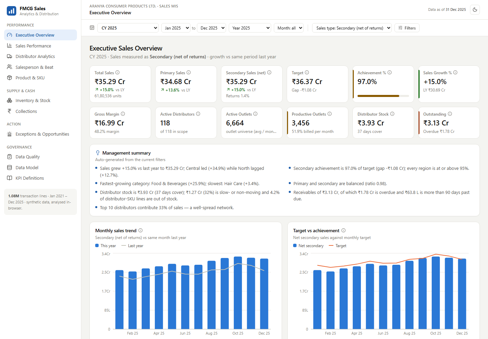
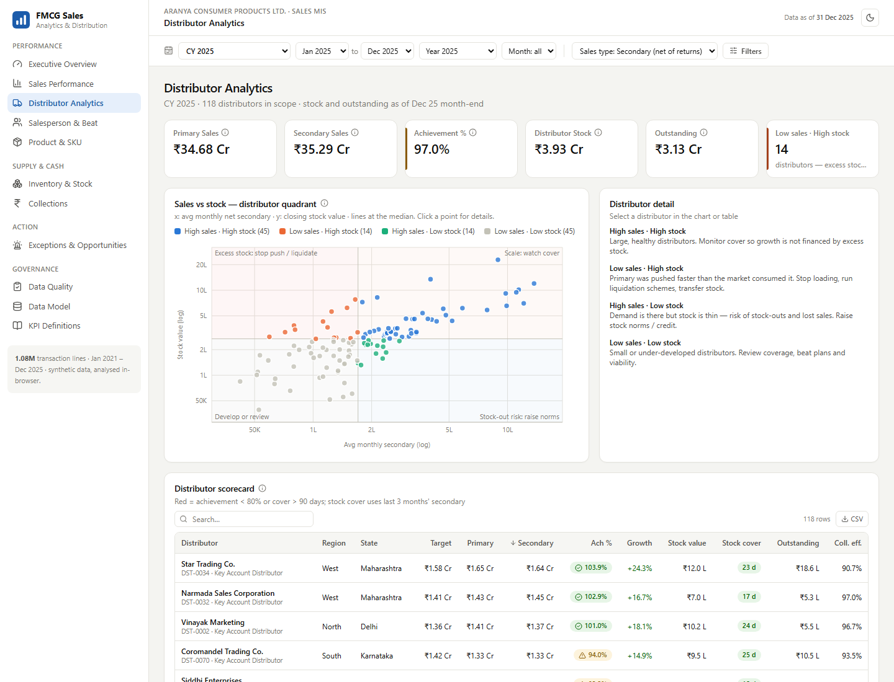
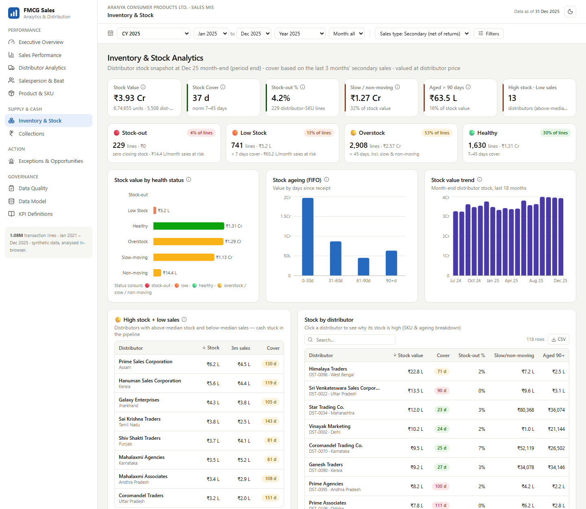
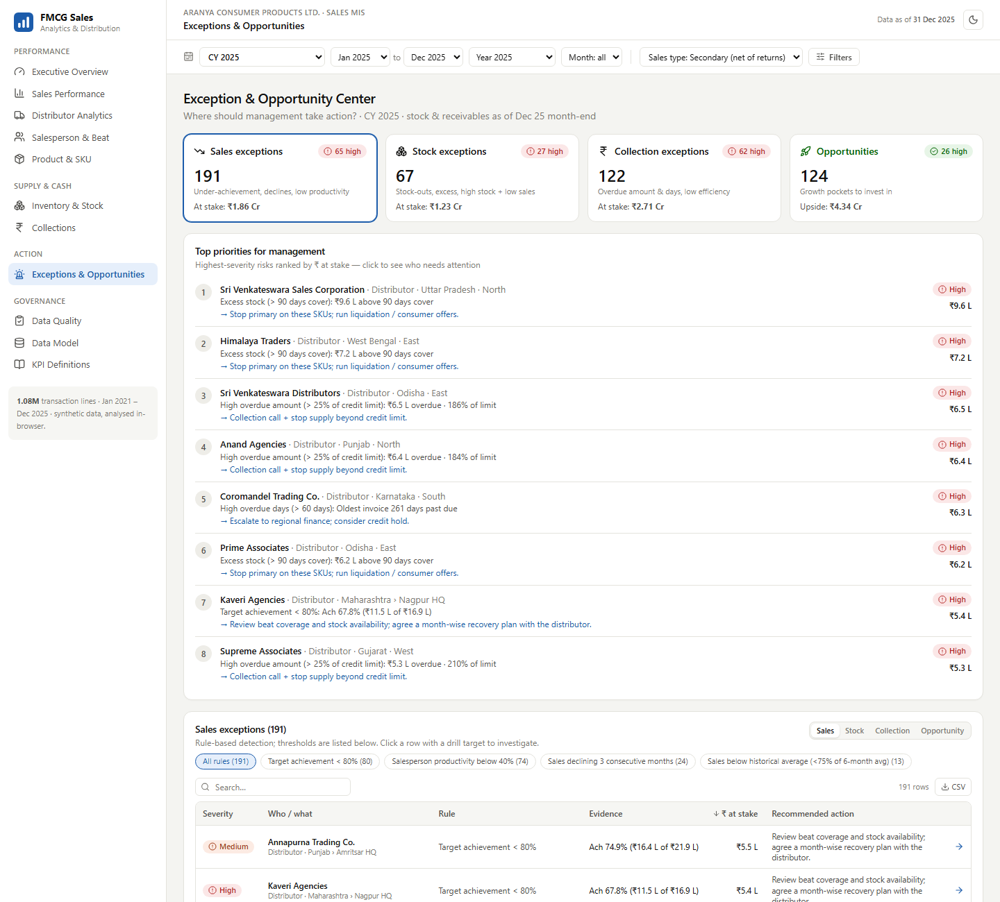
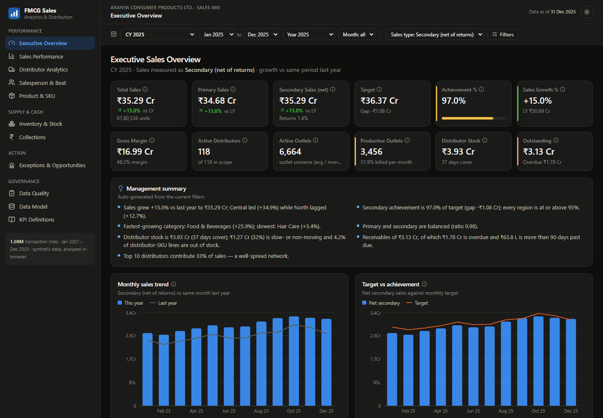
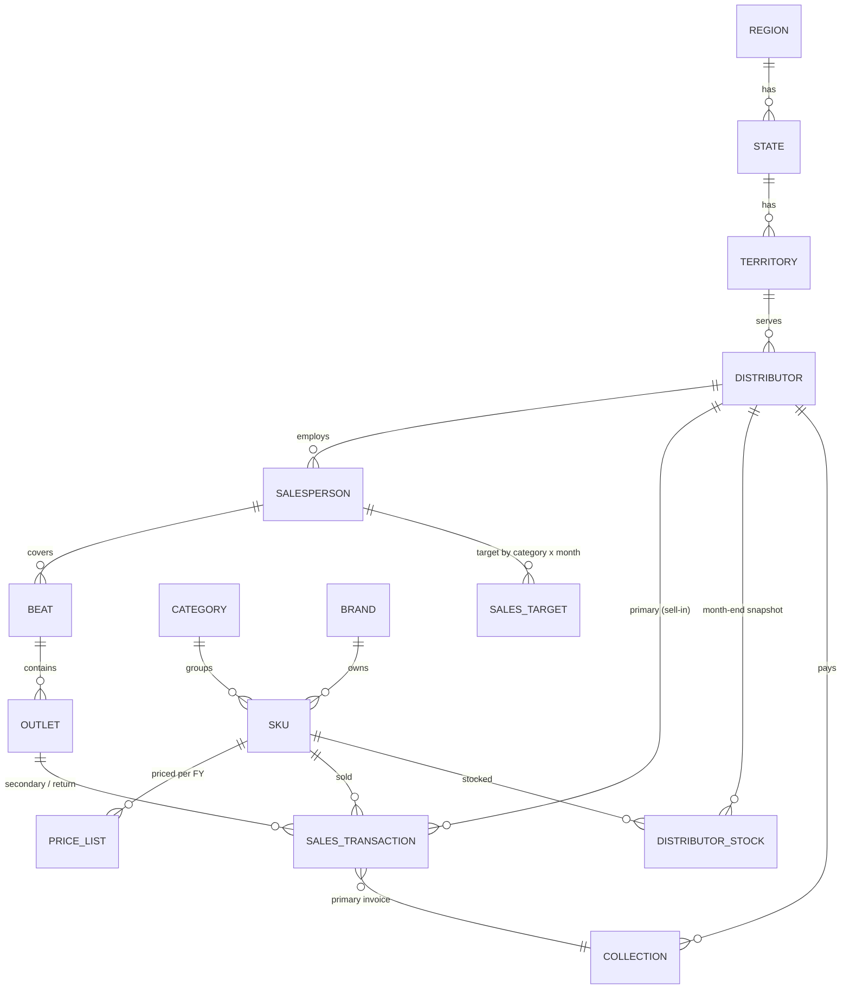
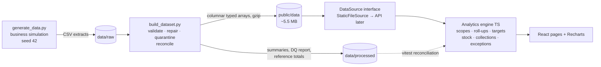

# FMCG Sales Analytics & Distribution Intelligence Dashboard

**A sales MIS for an Indian FMCG company, built on 5 years of synthetic data (about 1.08 million transaction lines).**
It covers primary and secondary sales, targets, distributor stock, collections, salesforce productivity and a management
exception centre. Everything is computed in the browser, so it needs no backend.

    

**Live demo:** `https://<your-github-username>.github.io/fmcg-sales-analytics/` (see [Deploy](#deploy))



---

## Contents
[Business problem](#business-problem) · [What the dashboard answers](#what-the-dashboard-answers) · [Pages](#pages) · [Dataset](#dataset) · [Data model](#data-model) · [Architecture](#architecture) · [KPIs](#kpi-definitions) · [Key insights](#key-business-insights) · [Interview walkthrough](#interview-walkthrough) · [Tech stack](#technology-stack) · [Run locally](#run-locally) · [Deploy](#deploy) · [Use real data](#replacing-the-dummy-data-with-real-data) · [Structure](#repository-structure) · [Future enhancements](#future-enhancements)

---

## Business problem
Sales reviews at a typical FMCG company are put together by hand from separate Excel extracts:

- primary billing from the ERP
- secondary sales and stock from the DMS
- targets from the annual plan
- receivables from Finance

The teams end up with different numbers. Problems also surface late. A distributor sitting on four months of stock, a
territory missing target or a growing overdue balance is often a month old before anyone sees it.

## Business objectives
1. **One version of the truth** for primary, secondary, target, stock and collections.
2. **Explain performance**: where growth comes from and where it leaks, from region down to outlet × SKU.
3. **Distributor health**: sell-in vs sell-out, stock cover, ageing, stock-outs and credit exposure.
4. **Action, not just reporting**: exceptions and opportunities ranked by ₹ impact, each with a recommended action.
5. **Trust**: documented KPI definitions, a visible data-quality score and automated reconciliation.

Full BRD: [docs/business_requirements.md](docs/business_requirements.md)

## What the dashboard answers
| Question | Where |
|---|---|
| Are we on target, and who is not? | Executive · Sales Performance |
| *Why did sales decline?* (Region → State → Distributor → Salesperson → Beat → Outlet → SKU) | Sales Performance, drill-down |
| Is primary running ahead of secondary (pipeline loading)? | Executive · Distributor Analytics |
| *Why is distributor stock high?* (Stock → Sales → Cover → SKU → Distributor → Ageing) | Distributor quadrant · Inventory |
| How productive is the sales force? | Salesperson & Beat |
| Which SKUs drive growth and margin, and which are dying? | Product & SKU |
| How much cash is stuck in receivables? | Collections |
| *Who needs attention this week?* | Exception & Opportunity Center |
| Can we trust the numbers? | Data Quality · KPI Definitions · Data Model |

## Pages
| # | Page | Highlights |
|---|---|---|
| 1 | **Executive Overview** | 12 KPI cards with growth vs last year, an auto-generated management summary, monthly trend vs LY, target vs achievement, primary vs secondary, region table, category mix, top 10 distributors and top 10 SKUs |
| 2 | **Sales Performance** | Switch between Region, State, Territory, Distributor and Salesperson; top and bottom performers; variance-to-target chart; exception highlighting; 7-level drill-down with contribution to change |
| 3 | **Distributor Analytics** | Scorecard (target, primary, secondary, achievement, growth, stock, cover, outstanding, collection efficiency); **sales-vs-stock quadrant** on log scales; distributor detail trend |
| 4 | **Salesperson & Beat** | Active and productive outlets (monthly), productivity %, sales per outlet, AOV, orders, lines per call; weighted **productivity score** ranking; beat and outlet views |
| 5 | **Product & SKU** | Category, brand, sub-category and SKU views; contribution; Pareto; top, bottom, fast-growing and declining SKUs; seasonality by category; margin trend |
| 6 | **Inventory & Stock** | 🔴 Stock-out · 🟠 Low · 🟡 Overstock · 🟢 Healthy tiles; slow- and non-moving stock; FIFO ageing; **high stock + low sales** list; "why is stock high" breakdown by distributor |
| 7 | **Collections** | Invoiced, collected, collection %, CEI, outstanding, overdue, days to collect; ageing buckets (not due, 0-30, 31-60, 61-90, 90+) by region, state and distributor; credit-limit use |
| 8 | **Exception & Opportunity Center** | 17 explicit rules across sales, stock, collections and opportunities; severity; ₹ at stake; recommended action; "who needs attention" drill-down |
| 9 | **Data Quality** | 19 validation rules, counts, samples, DQ % by table, and net-sales reconciliation |
| 10 | **Data Model** | Star schema, table grains, row counts, and how 1M rows run in the browser |
| 11 | **KPI Definitions** | 30 KPIs with definition, formula and business interpretation, plus an FMCG glossary |

**Global filters:** period (presets, date range, year, month), region, state, territory, distributor, salesperson, beat,
outlet type, category, brand, SKU and sales type. Lists cascade (for example, states are limited to the chosen
regions), and active filters show as removable chips. All tables can be searched, sorted, paginated and exported to CSV.
The app also has light and dark themes and a responsive layout.

<table><tr>
<td></td>
<td></td>
</tr><tr>
<td></td>
<td></td>
</tr></table>

More screenshots are in [`screenshots/`](screenshots).

---

## Dataset
The data is generated by a **business simulation**, not random numbers. It is deterministic (seed 42) and can be
rebuilt at any time with `python data/generate_data.py`.

| Entity | Count | | Fact table | Rows |
|---|---|---|---|---|
| Regions / States | 5 / 20 | | Sales transactions (Primary, Secondary, Return) | **1,080,477** |
| Territories / Cities | 63 / 89 | | Distributor stock snapshots (monthly) | 294,030 |
| Distributors | 118 | | Targets (salesperson × category × month) | 156,907 |
| Salespersons / Beats | 387 / 964 | | Collections (payments / open items) | 15,762 |
| Outlets | 7,175 | | SKU target mix | 12,633 |
| SKUs / Brands / Categories | 239 / 23 / 8 | | Period | Jan 2021 – Dec 2025 |

### Business behaviour built into the data
- **Demand** is generated outlet by outlet. It depends on outlet type (GT, pharmacy, MT, wholesale, e-commerce …),
  salesperson skill, distributor execution, regional growth, **seasonality** (summer, winter, monsoon, festive and
  Diwali), regional taste (coconut oil in the South, tea in the East, chyawanprash in the North) and SKU life cycle
  (core, premium, growing, declining, new launch, slow, discontinued).
- **Distributors** follow behavioural profiles: star, steady, under-performer, over-stocker and credit-constrained
  stock-out-prone. They reorder with an (s, S) policy that uses case-pack MOQs, mid-month top-ups and **quarter-end
  loading** (heaviest in March).
- **Secondary sales are capped by distributor stock**, so stock-outs cause real lost sales (3.4 % of demand). Slow
  SKUs bought in full packs become slow or non-moving stock.
- The **stock roll-forward** always holds: Opening + Primary − Secondary + Returns + Adjustment = Closing. Stock also
  carries FIFO ageing.
- **Returns** (about 1.4 %) come back the month after the sale, and damaged returns are written off.
- **Pricing** follows the Indian chain MRP → PTR → PTD with GST of 5, 12 or 18 %. Prices rise every April. In
  FY 2022-23, cost inflation (+11 %) beat the price increase (+7 %).
- **Targets** are set from last year's actuals plus a plan uplift. **Collections** follow each distributor's credit
  days and payment behaviour.
- **Events:** the COVID second wave (Apr–Jun 2021), a competitor entering Punjab and North Hair Care (Jul 2024), and
  faster growth in e-commerce and modern trade.
- **Data-quality defects are injected on purpose**: duplicates, missing keys, invalid dates, negative quantities,
  missing targets, broken stock roll-forwards and over-collection. The ETL catches every one of them.

Field-level documentation: [docs/data_dictionary.md](docs/data_dictionary.md)

## Data model


## Architecture


**How the browser handles 1M rows**
- Facts are published as **column-major typed arrays** (Uint16, Int32 and so on) and gzip-compressed. The 1.08M
  sales lines take about 4 MB and load in under a second.
- Money is **not stored per row**. On load, the app derives Net = Qty × Price(SKU, FY) × (1 − discount), and this is
  reconciled against the raw file to within ₹0.005.
- Rows are sorted by date, so any period is a **contiguous slice** of the arrays.
- Filters compile to **member masks**, so testing a row is an O(1) lookup.
- Each period is scanned once into a **distributor × SKU (or outlet) base matrix**. Geography and product views are
  rolled up from that matrix and cached per filter state.
- Pages are lazy-loaded, and recomputation is deferred so the filter controls never freeze. In a production build,
  switching to the full 5-year range re-renders in about 0.5 s.

## KPI definitions
There are 30 KPIs, each with a definition, formula and business interpretation. See
[docs/kpi_definitions.md](docs/kpi_definitions.md), the in-app **KPI Definitions** page, or the ⓘ tooltips on each card.

| KPI | Formula |
|---|---|
| Sales | Σ Qty × Price − Trade discount (ex-GST), on the selected basis |
| Achievement % | Net secondary ÷ Target × 100 |
| Growth % | (Current − Same period LY) ÷ Same period LY × 100 |
| Productive outlets | Outlets billed in a month (monthly average) |
| Stock cover | Closing stock ÷ (last-3-months secondary ÷ 91) |
| Stock-out % | Distributor-SKU lines with zero stock ÷ active lines |
| Collection efficiency (CEI) | (Opening + Invoiced − Closing outstanding) ÷ (Opening + Invoiced) |
| Margin % / Contribution % | Gross margin ÷ Net sales · Item ÷ Total |

## Key business insights
*These are from the default dataset. Each one can be reproduced in the dashboard.*

1. **Growth.** Net secondary for CY2025 is **₹35.3 Cr, +15.0 % vs 2024**, and achievement is **97.0 %**.
   East and South grow fastest. Central jumped **+35 %** after new distributor appointments.
2. **Punjab stalled.** It grew **+1.4 %** in 2025 against +15 % for the company. Year-on-year growth fell from +25–37 % in H1-2024 to
   around zero from Aug-2024 onward. The drop is spread across Punjab's distributors, which points to competitive
   pressure rather than one distributor's execution.
3. **North Hair Care fell −17 %** while Hair Care grew in every other region: a category-by-region problem, not a
   national one.
4. **Channel shift.** E-commerce is growing at a **26 % CAGR** and modern trade at 23 %, against about 15 % for general
   trade. Modern trade is now the largest channel, at 28 % of secondary sales.
5. **Pipeline loading.** The primary/secondary ratio spikes at quarter-end (**1.10 in June, 1.08 in September**).
   Over-stocking distributors take that load, and **32 % of distributor stock (₹1.27 Cr) is slow- or non-moving**.
6. **Stock-outs.** They cost about 3.4 % of demand and are concentrated in credit-constrained distributors. That
   group shows up in both the stock and collections exception lists, so it is one root cause, not two problems.
7. **Receivables.** ₹3.13 Cr is outstanding, of which **₹1.78 Cr is overdue** and ₹64 L is more than 90 days past due.
   Several distributors are above 180 % of their credit limit.
8. **Margin squeeze.** In FY 2022-23, input-cost inflation cut primary gross margin from **44.9 % to 43.2 %**. It
   recovered once the April-2023 price increase took effect.
9. **COVID second wave.** Secondary fell about 19 % between March and May 2021, while Health & Wellness rose about
   27 % in April.
10. **Portfolio concentration.** **72 of 230 selling SKUs make up 80 % of sales**, and 8 delisted SKUs still hold ₹5 L of
    distributor stock.
11. **Field productivity.** 51.9 % of outlets bill in an average month, and pharmacy and institutional outlets are the
    weakest channels. Lines per call are 2.8 and average order value is ₹5,049.

## Interview walkthrough
- **"Why did sales decline in Punjab?"** Go to Sales Performance, open the drill-down and select North, then Punjab.
  Compare distributors with LY, then pick a salesperson and a beat to find the outlets and SKUs that lost volume. Then
  check Inventory for the same distributors. Stock-outs are ruled out, so the cause is demand, not supply.
- **"Why is this distributor's stock high?"** Start on Distributor Analytics with the *Low sales · High stock*
  quadrant. Click the distributor, then open Inventory. The SKU breakdown shows cover and FIFO ageing (90+ days). The
  primary vs secondary chart shows the quarter-end loading that built the stock.
- **"Who needs attention?"** Use the Exception Center. Top priorities are ranked by ₹ at stake. Click one to drill
  Distributor → Salesperson → Beat → Outlet → SKU, and each item comes with a recommended action.
- **Data-analyst depth.** Point to the DQ page, which lists 19 rules with repaired and quarantined records, and to the
  reconciliation tests (pandas vs the TypeScript engine). Also explain the target grain decision (salesperson ×
  category, disaggregated with a plan mix) and why productivity is measured monthly.

## Technology stack
| Layer | Tools |
|---|---|
| Data generation & ETL | **Python 3, pandas, NumPy**: simulation, validation rules, quarantine, reconciliation |
| Front end | **React 19, TypeScript (strict), Vite**, React Router (hash routing for static hosting) |
| Visualisation | **Recharts** with a colour-blind-validated categorical palette, status colours paired with icons, dark mode |
| Styling | **Tailwind CSS v4** with design tokens |
| Analytics engine | Custom TypeScript "semantic model": Power BI-style measures such as SPLY growth, achievement, distinct counts, targets at grain, and roll-ups |
| Testing | **Vitest**: 20 reconciliation and business-rule tests |
| CI/CD | **GitHub Actions → GitHub Pages** |
| Concepts | Star-schema data modelling, KPI governance, data quality, Sales MIS, primary/secondary, DMS |

## Run locally
**Prerequisites:** Node.js 20.19+ (or 22+). Python 3.10+ with pandas and NumPy is only needed if you want to
regenerate the data.

```bash
npm install
```

```bash
npm run dev
```

Open http://localhost:5173. The processed data is already in `public/data`, so no Python is needed to run the app.

Other commands:

```bash
npm test
```

```bash
npm run build
```

```bash
npm run preview
```

### Regenerate the data (optional)
```bash
pip install -r data/requirements.txt
```

```bash
python data/generate_data.py
```

This takes about 60–90 s. It writes the raw extracts to `data/raw/` (git-ignored), then runs `build_dataset.py`, which
validates the data and publishes `public/data/` and `data/processed/`. Options include `--seed 7` for a different but
still reproducible world, `--scale 0.5` for a smaller dataset, and `--no-compress` for plain CSV.

## Deploy
### GitHub Pages (recommended)
1. Push the repository to GitHub, using `main` as the default branch.
2. Go to **Settings → Pages → Source** and select **GitHub Actions**.
3. Each push to `main` runs `.github/workflows/deploy.yml`, which does `npm ci`, then `npm test`, then `npm run build`,
   and then deploys.

The build uses relative asset paths (`base: './'`) and hash routing, so it works under
`https://<user>.github.io/<repo>/` without any configuration.

### Netlify / Vercel / any static host
- Build command: `npm run build`
- Publish directory: `dist`

## Replacing the dummy data with real data
- **File-based:** export the same CSV layouts (see the data dictionary) from your ERP or DMS into `data/raw/`, then run
  `python data/build_dataset.py`. Validation, repair, the DQ report and the browser bundle all come for free.
- **API-based:** implement the `DataSource` interface in [`src/data/loader.ts`](src/data/loader.ts). It needs
  `loadManifest`, `loadMasters`, `loadBundle` and `loadDataQuality`. Point it at SQL Server, MySQL or an Azure Function
  that returns the same columnar arrays, and pass it to `<DataProvider source={…}>`. No page code changes.

## Repository structure
```text
fmcg-sales-analytics/
├── README.md · LICENSE · package.json · vite.config.ts · tsconfig.json · index.html
├── .github/workflows/deploy.yml     CI: test + build + deploy to GitHub Pages
├── data/
│   ├── generate_data.py             deterministic business simulation → data/raw
│   ├── build_dataset.py             ETL: validate, repair/quarantine, reconcile, publish
│   ├── requirements.txt
│   ├── raw/                         generated CSV extracts (git-ignored, reproducible)
│   └── processed/                   DQ checks, quarantined records, BI summaries, reference totals
├── public/data/                     browser bundle (manifest, masters, *.bin.gz, data_quality.json)
├── src/
│   ├── analytics/                   engine.ts, views.ts, stock.ts, collections.ts, exceptions.ts (+ tests)
│   ├── charts/                      Recharts components + validated palette
│   ├── components/                  layout, filter bar, KPI cards, data table, drill explorer …
│   ├── content/kpis.ts              KPI dictionary (single source of truth)
│   ├── data/                        types + DataSource / loader
│   ├── pages/                       11 dashboard pages
│   ├── state/                       data, filter and theme contexts
│   └── utils/format.ts              ₹ Cr / L formatting
├── docs/                            business_requirements.md · data_dictionary.md · kpi_definitions.md
└── screenshots/
```

## Future enhancements
- **SQL Server / MySQL / Azure SQL** as the system of record, with the same star schema and incremental loads.
- **Power BI** semantic model and report using the same KPI definitions (the processed CSVs are Power BI-ready).
- **DMS and ERP APIs** (for example SAP or Tally exports) for daily secondary, stock and invoices.
- **Azure Functions or Data Factory** to schedule the ETL, and **row-level security** by region or distributor.
- Forecasting (demand, replenishment and stock norms per SKU), scheme ROI, and outlet segmentation.
- Alerts that email or message the exception list to ASMs every Monday.

---
*All companies, brands, people and figures are fictional and generated for demonstration.*
